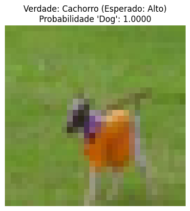

# Trabalho de inteligência artificial: Classificação binária com Logic Tensor Networks (LTN)

Este repositório contém a implementação de um classificador binário de cães e gatos utilizando o framework Neuro-Simbólico **LTNtorch** (Logic Tensor Networks em PyTorch). O projeto adapta a metodologia do artigo `LTNtorch: PyTorch Implementation of Logic Tensor Networks`, e usando imagens do dataset CIFAR-10.

Diferente de redes neurais tradicionais que aprendem puramente com uma função de perda baseada em erro (como CrossEntropy), este modelo aprende a satisfazer axiomas lógicos definidos em uma base de conhecimento.

## Alunos

- André Queiroz da Cruz Filho - 22352920
- Arthur Vinício Capucho Silva - 22351675
- Giovana Lins Cavalcanti - 22352925
- Pedro Barreto de Souza - 22351231
- Nycksandro Lima dos Santos - 22351228
- Rômulo Fernandes Torres - 22351220
- Ronald Vieira Cardoso da Silva - 22352934
- Victor Hugo Oliveira de Melo - 22352937

## O Problema

Classificar imagens $32 \times 32$ do dataset CIFAR-10 em duas classes:

  - Cachorro (Classe Positiva);
  - Gato (Classe Negativa).

## A Abordagem Neuro-Simbólica (LTN)

Utilizamos a Lógica de Primeira Ordem com semântica Fuzzy (Real Logic) para treinar a rede neural.

1. **Predicado Neural**: Uma CNN (Dog(x)) que mapeia uma imagem para um grau de verdade $[0, 1]$.
2. **Axiomas**:
    - $\forall x_{dogs} (Dog(x_{dogs}))$: "Para toda imagem de cachorro, o predicado deve ser verdadeiro."
    - $\forall x_{cats} (\neg Dog(x_{cats}))$: "Para toda imagem de gato, o predicado deve ser falso."
3. **Otimização**: O modelo é treinado para maximizar a satisfação agregada (sat_agg) desses axiomas.

## Como Executar

Execute o notebook `Classificador_Dogs_and_Cats.ipynb` deste repositório.

### Instalação das dependências

Instale as dependências em uma célula de instalação no notebook ou via pip:

- **PyTorch** (Modelagem da CNN e tensores)
- **LTNtorch** (Lógica fuzzy e componentes Neuro-Simbólicos)
- **Torchvision** (Dataset CIFAR-10 e transformações)
- **Numpy** (Manipulação de arrays e tensores)
- **Matplotlib** (Visualização)

Versão python:

- **Python** 3.x

## Estrutura do código

O notebook está organizado da seguinte forma:

- Material expositivo de **Redes Lógicas Tensoriais** (LTN).
- Tutorial Prático: Classificação de imagens de cães e gatos:
  1. Imports e definição do modelo;
  2. Preparação dos dados (CIFAR-10);
  3. Definição lógica LTN;
  4. O loop de treinamento;
  5. Avaliação e métricas.

## Resultados

O modelo foi projetado para superar o problema de *vanishing gradient* comum em lógicas fuzzy com redes não treinadas.

- Acurácia Inicial (Aleatória): ~50%
- Acurácia Final (Pós-Treino): 80-90% no conjunto de teste.

Exemplo de Predição Visual:

O notebook gera visualizações como esta ao final da execução:

## Referências

Artigo Original: [Logic Tensor Networks (Badreddine et al., 2022)](https://arxiv.org/abs/2012.13635)

Repositório LTNtorch: https://github.com/logictensornetworks/LTNtorch

Dataset: [CIFAR-10](https://www.cs.toronto.edu/~kriz/cifar.html)

Artigo do Tommaso Carraro: [LTNtorch: PyTorch Implementation of Logic Tensor Networks (Tommaso Carraro et al., 2024)](https://arxiv.org/abs/2409.16045)

Repositório do Tommaso Carraro: https://github.com/tommasocarraro/LTNtorch